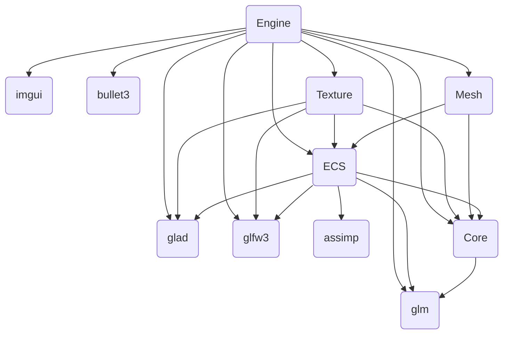

# Library Dependency Graph

```mermaid
graph TD
  glm("glm")
  glad("glad")
  glfw3("glfw3")
  assimp("assimp")
  imgui("imgui")
  bullet3("bullet3")

  Core("Core")
  ECS("ECS")
  Engine("Engine")
  Mesh("Mesh")
  Texture("Texture")

  Core --> glm

  ECS --> glm
  ECS --> glad
  ECS --> glfw3
  ECS --> assimp

  ECS --> Core

  Mesh --> Core
  Mesh --> ECS

  Texture --> glad
  Texture --> glfw3

  Texture --> Core
  Texture --> ECS

  Engine --> glm
  Engine --> glad
  Engine --> glfw3
  Engine --> imgui
  Engine --> bullet3

  Engine --> Core
  Engine --> Mesh
  Engine --> ECS
  Engine --> Texture
```